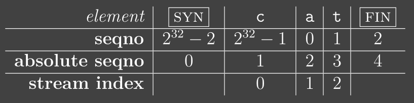

## 开始
```bash
git branch lab2-startercode
git fetch
git merge origin/lab2-startercode
```

## 任务
- [x] Implementing the WrappingInt32
- [ ] Implementing the TCP receiver
    - [ ] receive segments from its peer.
    - [ ] reassemble the ByteStreamusing your StreamReassembler.
    - [ ] calculate the acknowledgment number (ackno) and the window size.

TheTCPReceiverreceives segments fromthe Internet(via thesegment received()method) and turns them into calls to yourStreamReassembler, which eventually writes to the incomingByteStream.

In addition to writing to the incoming stream, theTCPReceiveris responsible for telling thesender two things :
1.the index of the “first unassembled” byte, which is called the “acknowledgment number”or “ackno.” This is the first byte that the receiver needs from the sender.
2.the distance between the “first unassembled” index and the “first unacceptable” index.This is called the “window size”.


* TCP头部的索引是32-bit的，因为TCP header空间是宝贵的
* 用32-bit实现环形指针，因为数据流没有限制，但32bits只有4GB
* TCP报文段的序号是随机值开始的 (Initial Sequence Number, ISN)
* 第一字节的序列号是 ISN+1 (mod 23^2)
* 为了确保能完整收到，SYN和FIN各占一个序列号，但是并不算在数据流的大小计算中

* [TCP报文段说明](https://cs144.github.io/doc/lab2/class_t_c_p_segment.html)
* [TCP头部说明](https://cs144.github.io/doc/lab2/struct_t_c_p_header.html)
* size_t TCPSegment::length_in_sequence_space() const : Equal to payload length plus one byte if SYN is set, plus one byte if FIN is set
*  In your TCP implementation, you’ll use the index of the last reassembled byte as the checkpoint.
* 有可能一个报文段同时是SYN和FIN, 且没有携带任何数据
* 还没有收到SYN的报文段之前，所有的报文段应该丢弃，这是测试样例 recv_special 的要求
* 有时候一个带SYN的报文段可能数据为空

* TCPReceiver::segment received()
    * Set the Initial Sequence Number if necessary.
    * Push any data, or end-of-stream marker, to theStreamReassembler.
## 测试方式
* ctest -R wrap 测试 WrappingInt32 类是否实现
* make check_lab2


## 提示
### 任务一
* 照着这个标进行映射即可


### 任务二
* TCPReceiver仍然带一个缓冲区，接收报文段
* 如果SYN=true 代表收到相对序号为0的报文段


## 测试结果
```bash

Test project /home/ly/Desktop/cpp_code/CS144learn/build
    Start 1: t_wrapping_ints_cmp
1/4 Test #1: t_wrapping_ints_cmp ..............   Passed    0.01 sec
    Start 2: t_wrapping_ints_unwrap
2/4 Test #2: t_wrapping_ints_unwrap ...........   Passed    0.00 sec
    Start 3: t_wrapping_ints_wrap
3/4 Test #3: t_wrapping_ints_wrap .............   Passed    0.00 sec
    Start 4: t_wrapping_ints_roundtrip
4/4 Test #4: t_wrapping_ints_roundtrip ........   Passed    0.20 sec

100% tests passed, 0 tests failed out of 4
```
```bash
[100%] Testing the TCP receiver...
Test project /home/haha/Desktop/cpp_code/CS144learn/build
      Start  1: t_wrapping_ints_cmp
 1/26 Test  #1: t_wrapping_ints_cmp ..............   Passed    0.00 sec
      Start  2: t_wrapping_ints_unwrap
 2/26 Test  #2: t_wrapping_ints_unwrap ...........   Passed    0.00 sec
      Start  3: t_wrapping_ints_wrap
 3/26 Test  #3: t_wrapping_ints_wrap .............   Passed    0.00 sec
      Start  4: t_wrapping_ints_roundtrip
 4/26 Test  #4: t_wrapping_ints_roundtrip ........   Passed    0.13 sec
      Start  5: t_recv_connect
 5/26 Test  #5: t_recv_connect ...................   Passed    0.00 sec
      Start  6: t_recv_transmit
 6/26 Test  #6: t_recv_transmit ..................   Passed    0.03 sec
      Start  7: t_recv_window
 7/26 Test  #7: t_recv_window ....................   Passed    0.00 sec
      Start  8: t_recv_reorder
 8/26 Test  #8: t_recv_reorder ...................   Passed    0.00 sec
      Start  9: t_recv_close
 9/26 Test  #9: t_recv_close .....................   Passed    0.00 sec
      Start 10: t_recv_special
10/26 Test #10: t_recv_special ...................   Passed    0.00 sec
      Start 18: t_strm_reassem_single
11/26 Test #18: t_strm_reassem_single ............   Passed    0.00 sec
      Start 19: t_strm_reassem_seq
12/26 Test #19: t_strm_reassem_seq ...............   Passed    0.00 sec
      Start 20: t_strm_reassem_dup
13/26 Test #20: t_strm_reassem_dup ...............   Passed    0.00 sec
      Start 21: t_strm_reassem_holes
14/26 Test #21: t_strm_reassem_holes .............   Passed    0.00 sec
      Start 22: t_strm_reassem_many
15/26 Test #22: t_strm_reassem_many ..............   Passed    0.08 sec
      Start 23: t_strm_reassem_overlapping
16/26 Test #23: t_strm_reassem_overlapping .......   Passed    0.00 sec
      Start 24: t_strm_reassem_win
17/26 Test #24: t_strm_reassem_win ...............   Passed    0.08 sec
      Start 25: t_strm_reassem_cap
18/26 Test #25: t_strm_reassem_cap ...............   Passed    0.05 sec
      Start 26: t_byte_stream_construction
19/26 Test #26: t_byte_stream_construction .......   Passed    0.00 sec
      Start 27: t_byte_stream_one_write
20/26 Test #27: t_byte_stream_one_write ..........   Passed    0.00 sec
      Start 28: t_byte_stream_two_writes
21/26 Test #28: t_byte_stream_two_writes .........   Passed    0.00 sec
      Start 29: t_byte_stream_capacity
22/26 Test #29: t_byte_stream_capacity ...........   Passed    0.28 sec
      Start 30: t_byte_stream_many_writes
23/26 Test #30: t_byte_stream_many_writes ........   Passed    0.00 sec
      Start 53: t_address_dt
24/26 Test #53: t_address_dt .....................   Passed    0.00 sec
      Start 54: t_parser_dt
25/26 Test #54: t_parser_dt ......................   Passed    0.00 sec
      Start 55: t_socket_dt
26/26 Test #55: t_socket_dt ......................   Passed    0.00 sec

100% tests passed, 0 tests failed out of 26
```
* 调试bug，终于通过

## origin readme.md
Lab 2 Writeup
============ =

My name : [your name here]

My SUNet ID : [your sunetid here]

I collaborated with : [list sunetids here]

I would like to thank / reward these classmates for their help : [list sunetids here]

This lab took me about[n] hours to do.I[did / did not] attend the lab session.

Program Structureand Design of the TCPReceiverand wrap / unwrap routines :
[]

Implementation Challenges :
[]

Remaining Bugs :
[]

- Optional : I had unexpected difficulty with : [describe]

- Optional : I think you could make this lab better by : [describe]

- Optional : I was surprised by : [describe]

- Optional : I'm not sure about: [describe]
